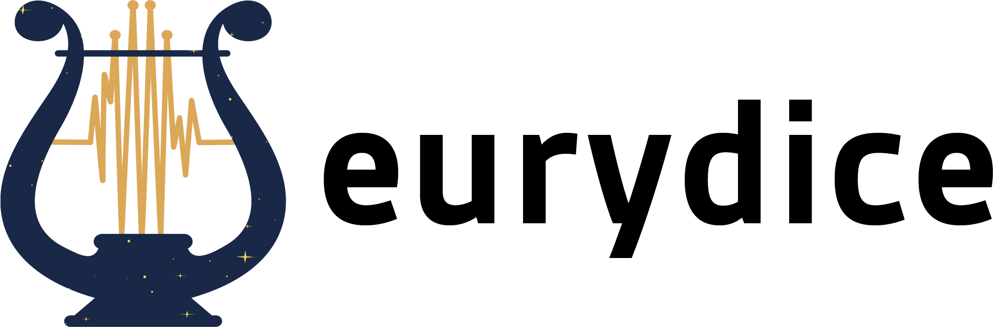

Hello there! Welcome to the documentation for ``eurydice``, a Python package for performing cross-validation on Gaussian Process stellar activity models. 

``eurydice`` is actively being developed in a `public repository on GitHub <https://github.com/kaybarr4/eurydice>`_. If you find a bug, want to request a feature, etc. please
create an `issue on GitHub <https://github.com/kaybarr4/eurydice/issues>`_.  

User Guide:
+++++++++++

.. toctree::
   :maxdepth: 2

   installation 
   tutorial
   api

Changelog:
++++++++++

**0.4 (2024-8-16)**

- restructured CrossValidation object to take in pre-defined training and test sets 
- restructered split function and CrossValidation object to take in data as pandas dataframes for compactness
- new Kernel module: created a Kernel abstract base class for users to utilize in defining their kernels and restructured build_covariance_matrix function and defaultKernel 
- adding/modifying unit tests for new restructured code

**0.3 (2024-7-24)**

- officially named eurydice!!
- implementation of first version of docs
- added first set of test functions
